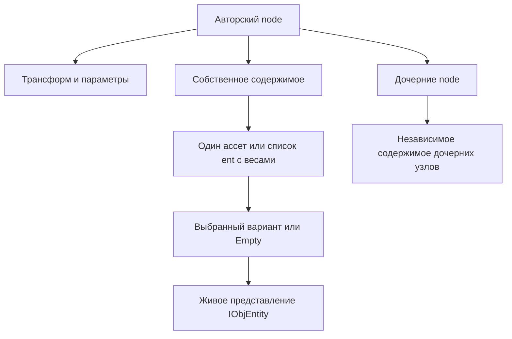

> Status: REFERENCE · Исследование C++, 2026-09-08 · Предложения для MH, не утверждённый контракт реализации.

# Asset Viewer Composit Editor: node, entity и основа расширения MH EditMode

Проверены исходники `GaijinEntertainment/DagorEngine` на commit
`75723669297e48e200a0dc67b18c1629e0975daf` — текущая вершина `main` по GitHub API
на дату исследования, commit от 2026-08-16. Сопоставление MH выполнено на
`8826fa17493bcab1de0776807ce12312bf1f2c3e`, после удаления legacy Edit backend.
Это исследование исходников: Asset Viewer не запускался; отмеченные ниже
пограничные случаи не выдаются за результаты полевого теста.

Дополняет [предыдущее исследование вложенного Edit](dagor_assetviewer_composite_edit_20260907.md).
Здесь основной предмет — панель содержимого, **Add node / Add entity**, замена,
параметры и перенос принципов в уже существующую Session/Projection архитектуру.

## 1. Основное различие: три уровня, а не два

| Термин | Что это в Dagor | За что отвечает |
| --- | --- | --- |
| `node {}` | Авторский структурный узел рецепта | Место в иерархии, transform/разброс, параметры размещения, собственное содержимое и дочерние узлы |
| `ent {}` в панели Entities | Один вариант собственного содержимого узла | Ссылка на ассет и вес; своего transform и обычных дочерних узлов в поддерживаемом UI не имеет |
| `IObjEntity` | Интерфейс объектов представления: прототипов и созданных экземпляров | Представление ассета; им может быть и целый подкомпозит, раскрывающийся в множество объектов |

Следовательно, `ent` не означает UE Actor, StaticMeshComponent или ECS entity.
Слово entity встречается и в рецепте, и в интерфейсе живых объектов, но это
разные уровни. Один вариант `ent` может ссылаться на композит с десятками мешей.
[Модель дерева][AV-node], [прототипы и кандидаты][DG-candidates],
[создание экземпляров][DG-materialize].

Например, у узла ворот два `ent`: закрытые ворота с весом 3 и открытые с весом 1.
Это **одно место для ворот**, в котором выбирается один вариант; это не двое ворот,
стоящих одновременно. Второй `node` ворот создаёт второе независимо размещаемое
место. Пустой вариант означает отсутствие собственного объекта узла.

В Dagor узел может иметь собственный ассет/варианты **одновременно с дочерними
`node`**. Дочерние узлы обрабатываются независимо: выбор Empty убирает собственное
содержимое, но не отменяет дочерние узлы. Чистая группа участвует в наследовании
матриц без собственного объекта. [Обход узлов][DG-children], [применение матрицы
до проверки наличия объекта][DG-evaluate].

### Прямая ссылка и варианты

- `name` непосредственно на `node` — сокращённое задание кандидата с весом 1.
- Дочерние `ent` задают кандидатов с явными весами; значение по умолчанию — 1.
- Исполнитель допускает даже повторные `name` и смесь `name` + `ent`. Это всё
  кандидаты одного выбора, а не несколько одновременных объектов.
- Поддерживаемый UI ограничен строже: `Change asset` доступен без `ent`,
  `Add entity` — без параметра `name`, вне root и не на самом `ent`.

Нельзя переносить разрешения permissive-парсера как обещание полноценной
поддержки этих комбинаций редактором. [Capability-проверки][AV-capabilities],
[разбор списка кандидатов][DG-candidates].

## 2. Как собрана панель

Это согласованный набор классов, а не один property grid:

| Класс | Роль |
| --- | --- |
| `CompositeEditorTreeDataNode` / `CompositeEditorTreeData` | Исходное дерево: `DataBlock params`, дочерние блоки, соответствие живым объектам |
| `CompositeEditorTree` | Иерархия, выбор, иконки типов, контекстное меню через контроллер |
| `CompositeEditorPanel` | Поля и списки для выбранной записи; возвращает требуемый вид обновления |
| `CompositeEditor` | Команды, Undo, запись дерева в рабочие props ассета, отложенный refresh, Save и вложенный контекст |
| `CompositeEditorGizmoClient` / `CompositeEditorViewport` | Манипулятор и связь viewport с исходными записями |

Панель меняется по виду выделения. Для `ent` показывается **Entity**: ассет,
удаление и Weight. Для обычного узла — **Entities** со списком вариантов. Ещё
есть **Children**, **Node transforms**, **Composit** с Save/Reset и при подходящем
выделении Split, Save as new composite, Sub-composite Save/Unique/Revert.
У root нет собственного редактора transform; там находится asset-wide
`Auto-reseed enabled`. У `ent` transform-поля тоже недоступны.
[Построение секций][AV-panel-layout].

Entities и Children — две проекции одного массива вложенных блоков:
первая фильтрует `ent`, вторая остальные блоки. Это не два независимых массива
документа. Каждая строка имеет asset selector, нужные inline actions; варианты
дополнительно имеют вес. [Построение списков][AV-panel-lists].

## 3. Add node — полный путь

### Контекстное меню дерева

1. `onTvContextMenu` проверяет `canEditChildren()` — запрет относится к `ent`.
2. `CM_COMPOSITE_EDITOR_ADD_NODE` вызывает `createNode(selected, false)`.
3. Создаётся Undo-запись, затем `insertNodeBlock(-1)` добавляет запись **в конец
   детей выбранного узла**, а не рядом с ним.
4. У нового блока имя типа `node`, матрица identity, ассет ещё не назначен.
5. `updateAssetFromTree(EntityAndCompositeEditor)` обновляет рабочее представление
   ассета, затем entity, дерево и панель. Файл пока не сохраняется.

Identity здесь — локальная матрица относительно родителя. Новый узел расположен
в его начале координат, а не автоматически под курсором. Это важная часть
контракта будущей команды размещения. [Меню][AV-menu], [createNode][AV-add-node],
[insertNodeBlock][AV-insert].

### Кнопка Create node на toolbar

Ведёт в тот же `createNode`, но с выбором ассета. `CompositeEditorAddNodeDlg`
предлагает **Create node with asset** и **Add empty node**. Вторая кнопка
технически использует `DIALOG_ID_CANCEL`, но подписана как создание пустого
узла: это отдельное действие, а не универсальный образец Cancel для MH.
После выбора ассета новому `node` назначается `name`.
[Диалог и создание][AV-add-node].

### Кнопка `+` в Children и drag-and-drop

- `Children +` создаёт пустой дочерний `node` без asset dialog.
- Drop ассета на `Children +` создаёт дочерний `node` и сразу назначает `name`.
- Insert в строке Children вставляет пустой `node` перед этой строкой.
- Drop на selector существующей строки заменяет её ассет, не создавая узел.

Таким образом, **место drop определяет операцию**. [Обработчики Children][AV-panel-add],
[drop в панель][AV-panel-drop]. В отличие от Duplicate, Add node не назначает
новый узел в `selectedTreeDataNode` явно. В MH лучше заранее определить требуемый
выбор нового узла и положение gizmo, а не зависеть от побочного refresh.

Важный край реализации: контекстное меню и panel drop проверяют capabilities,
но общий `createNode(parent, ...)` сам не повторяет `canEditChildren()`.
Для MH валидировать допустимого родителя нужно в command API независимо от
того, пришло действие с toolbar, горячей клавиши, дерева или drop.

## 4. Add entity — полный путь и принципиальная разница

### Контекстное меню дерева

1. Команда показывается только при `canEditRandomEntities`: выбран обычный
   не-root узел **без параметра `name`**.
2. `CM_COMPOSITE_EDITOR_ADD_RANDOM_ENTITY` создаёт Undo-запись.
3. `insertEntBlock(-1)` добавляет дочерний `ent` с пустым `name` и весом **1**.
4. Выбранной записью явно становится новый `ent`.
5. Entity/дерево/панель обновляются; ассет можно назначить через selector или drop.

Новый `ent` **не получает identity matrix**, потому что собственного transform
у этого варианта нет: он использует transform узла-владельца. Пока имя пустое,
он является Empty-вариантом. [Меню Add entity][AV-menu-actions], [вставка блоков][AV-insert].

### Кнопка `+` в Entities

Открывает picker поддержанных генерируемых типов ассетов, добавляет `ent`,
при выбранном ассете заполняет его имя. Drop на этот `+` делает то же без picker.
Insert добавляет пустой вариант перед указанной строкой; Remove удаляет вариант.
Drop на selector варианта меняет его ссылку, сохраняя запись и вес.
[Добавление/замена][AV-panel-add], [drag-and-drop][AV-panel-drop].

Пограничное поведение C++: в обработчике `Entities +` и null-ответ picker, и пустое
имя приводят к созданию пустого варианта. В MH Cancel picker должен означать
отсутствие изменения; создание Empty следует оставить явной командой.

### Что происходит с уже назначенным ассетом

**Автоматического преобразования прямого `name` в первый `ent` здесь нет.**
У такого узла Add entity скрыт capability-проверкой. Более того, наличие самого
параметра `name`, даже пустого, блокирует этот путь. `Change asset` с пустым
результатом удаляет параметр; drop с полноценным ассетом его устанавливает.
[Capabilities][AV-capabilities], [Change asset][AV-menu-actions].

Для MH нужен более явный и удобный контракт: **«Добавить вариант» к обычному
ассету** атомарно превращает содержимое узла в Random, сохраняет текущий ассет
первым вариантом и добавляет второй. Это предложение для MH, не описание
имеющегося поведения Dagor или текущего MH API.

| Действие | Что появляется | Где живёт transform | Результат в сцене |
| --- | --- | --- | --- |
| Add node | Ещё один структурный узел | У нового узла | Независимое место для объекта/композита; при пустом содержимом геометрии ещё нет |
| Add entity | Ещё один кандидат узла | У узла-владельца | Меняется набор вариантов одного места; новый кандидат не обязан оказаться выбранным |
| Change asset | Новая ссылка в существующей записи | Сохраняется | Подмена содержимого на прежнем месте |
| Duplicate node | Копия авторского поддерева рядом с исходным | Копируется | Ещё одно размещение того же содержания; ссылки на внешние композиты остаются ссылками |

## 5. Замена содержимого и структура

Обычная замена в Dagor — изменение `params.name`. Остальные параметры и дочерние
блоки не переписываются; устаревший `type` удаляется. Picker и drop допускают
набор `getGenObjAssetTypes()`, а не только Static Mesh. Комментарий про «тот же
тип» в drop-коде не соответствует фактической проверке членства в общем списке
допустимых типов. [Change asset][AV-menu-actions], [tree drop][AV-tree-drop].

Замена ссылки на подкомпозит и редактирование его определения — разные операции.
Вторая требует отдельного nested edit context. Общая и уникальная публикации
уже исследованы в предыдущей заметке; они не сводятся к замене визуального
компонента в сцене.

Duplicate сериализует авторское поддерево, вставляет копию сразу после исходного
под тем же родителем и выделяет её. Reparent пересчитывает локальную матрицу для
сохранения положения в мире **для матричной иерархии**. Расчёт использует сохранённые
`tm`, а при их отсутствии — identity; вычисленные procedural ranges узла и его
предков в этот расчёт не входят. Поэтому сохранение текущего вида procedural
иерархии этим кодом не гарантируется. [Расчёт при смене родителя][AV-reparent].
После некоторых structural actions оставшийся одиночный
непустой `ent` преобразуется в дочерний обычный `node` с identity, сохраняя внешний
узел-владелец. Это не простое переименование `ent` и не обязательная нормализация
любого одиночного списка. [Clone и Duplicate][AV-copy], [преобразование][AV-insert].

## 6. Добавление и редактирование параметров

### Это реестр поддержанных полей

В `CompositeEditorPanel` зарегистрированы **11** параметров с типами и
значениями по умолчанию. Активный UI рисует имеющиеся поля с Remove, отсутствующие
— как Add param. Обработчик Add берёт тип/значение из реестра; Remove удаляет
параметр из `DataBlock`. Это не универсальный редактор произвольных пар key/value.
[Реестр][AV-parameter-registry], [построение полей][AV-parameter-fields],
[действующие Add/Remove handlers][AV-panel-param-actions].

| Параметры Dagor | Тип / начальное значение при Add | Назначение |
| --- | --- | --- |
| `rot_x`, `rot_y`, `rot_z` | `Point2(0, 0)` | Углы: базовое значение и симметричное отклонение |
| `offset_x`, `offset_y`, `offset_z` | `Point2(0, 0)` | Смещение: база и отклонение |
| `scale` | `Point2(1, 0)` | Общий масштаб |
| `yScale` | `Point2(1, 0)` | Дополнительный множитель вертикального масштаба Dagor |
| `place_type` | int, none | Способ размещения на коллизии: pivot/normal/3-point/foundation/water/RI collision |
| `aboveHt` | real, 0 | Высота, связанная с процедурой размещения |
| `ignoreParentInstSeed` | bool, true при Add | Граница наследования instance seed |

Тип `Point2` здесь обозначает пару «база, отклонение», а не min/max. В UI углы
задаются в градусах. Dagor имеет Y-up; в MH интерфейс должен пользоваться уже
принятыми UE-координатами, сантиметрами и вертикальным Z, а не переставлять
сырые поля на лету. Общий scale и дополнительный вертикальный множитель —
разные параметры. [Исполнение transform][DG-transform], [MH sample/application][MH-random].

В файле остались helper-методы с MultiListDialog для добавления/удаления списка
параметров. В проверенном snapshot вызовов этих двух методов не найдено;
действующий путь — кнопки у отдельных полей. Поэтому наличие helper-функции
не считается доказательством доступной пользователю команды.

### Matrix и procedural — не два одновременно редактируемых источника

При наличии `tm` исполнитель использует матрицу. Панель показывает Location,
Rotation и Scale; поля диапазонов становятся недоступными для прямого ввода.
Без `tm` используются отдельные параметры. Переключение в matrix берёт базовые
значения диапазонов; сами параметры могут оставаться в DataBlock. При обратном
переходе учитывается несовместимость независимых X/Z scales: Dagor показывает
диалог о потере Z. Это не преобразование, которое можно объявить безусловно
без потерь. [Матрица и поля][AV-panel-layout], [переключение][AV-transform-mode],
[приоритет матрицы в evaluator][DG-transform-load].

Copy params переносит параметры одной записи, без её дочерних блоков. Paste
заменяет весь набор параметров через `setParamsFrom`, а не только transform:
в него могут попасть имя, вес и другие поля исходной записи. MH лучше разделить
«Copy transform», «Copy variation» и «Duplicate node», с проверкой схемы до
мутации. [Copy/Paste][AV-copy].

## 7. Обновление, Undo и идентичность

- Рабочее дерево отдельно от файла: `updateAssetFromTree` сериализует **весь
  root**, пересчитывает ID, меняет `editedAsset->props` и ставит `modified`.
  Дисковый Save выполняется отдельно.
- Refresh разделён на Entity, Entity+Transformation и Entity+CompositeEditor;
  изменения структуры перестраивают дерево, обычные изменения свойств могут
  обходиться без этого. Обновление откладывается, чтобы не уничтожить control
  внутри его собственного callback.
- Один gizmo gesture — один Undo. Кэшируются родительские матрицы и базисы;
  выделенные потомки исключаются, если уже двигается выделенный предок.
- UI suppression во время drag **не отменяет** сериализацию root и asset reload.
  Возвращать MH к такому пути после уже достигнутого плавного drag не следует.

[Refresh][AV-refresh], [Undo/clone][AV-copy], [gesture][AV-gizmo].

`dataBlockId` — пересчитываемый номер обхода, не сохраняемый GUID. Порядок его
вычисления должен совпадать с executor; живой объект получает ID выбранного
кандидата. Вставки меняют эти номера; группы без собственного кандидата могут
не иметь ID. Исходное дерево и список живых объектов поэтому не тождественны.
[Загрузка, IDs, сериализация][AV-tree-data]. MH следует сохранить собственные
transactional NodeId и отдельное отображение NodeId → projection, а для будущих
операций со списками ввести устойчивую идентичность вариантов в пределах сессии.

Пограничные случаи, которые нельзя превращать в целевой UX MH:

1. Нулевые/отрицательные веса: Dagor не отклоняет их в этом коде, при сумме ≤0
   использует знаменатель 1. Это не равномерный выбор; алгоритм имеет fallback
   последнего кандидата. MH должен сохранить свою валидацию и RNG-контракт.
2. Не найденный ассет даёт null с диагностикой; намеренный Empty тоже null,
   но без ошибки. Null-кандидаты сохраняются в списке выбора с весами, только
   если есть хотя бы один действительный прототип; при всех null исполнитель
   очищает список. Авторский `ent` при этом остаётся в документе. В интерфейсе
   эти состояния нужно различать.
3. В `UndoParams::loadUndo` используются текущие IDs выбора вместо сохранённых
   в undo-record. По чтению кода это вероятная проблема восстановления selection,
   а не проверенная ошибка запущенного Asset Viewer.
4. Существующие camera remap и общую политику очистки Undo Dagor не следует
   переносить как новые правила MH: у MH уже принят свой UE/BPP-контракт.

[Выбор и веса][DG-choice], [null-кандидаты][DG-candidates], [Undo selection][AV-undo].

Структура тоже влияет на случайные выборки: даже единственный кандидат вызывает
`rnd()` перед возвратом. Поэтому схлопывание списков и перестановки нельзя считать
нейтральными для последующих выборок. Это дополнительная причина переносить UX
через собственные команды MH, сохраняя его RNG-семантику. [Выбор кандидата][DG-choice].

## 8. Что уже есть в MH, а чего не хватает

Исследование не предлагает переписать Editor Mode. На текущем main уже работают:

| Область MH | Реализовано | Ограничение для расширения |
| --- | --- | --- |
| Draft | Transactional document, отдельные сессионные NodeId | Source-пути позиционные; GUID не являются постоянной идентичностью файла |
| Создание | Add Group/Random; drop managed mesh/composite создаёт узлы | Add/Reparent разрешают новых детей только у Group; Actor/GameObj есть в API, не в этом drop picker |
| Duplicate/Delete | Копия authored subtree рядом, новые GUID; удаление subtree | Копия ссылки на Composite не создаёт уникального определения |
| Reparent | Command API, keep-world и проверки представимости | Drag существующих строк ещё не подключён: drop обрабатывает только Content Browser assets |
| Замена | `SetNodeResource` сохраняет Kind, NodeId, transform и metadata | Нет смены Kind, универсального replace-content/subtree или Single → Random |
| Random | AddRandom, веса, удаление и Empty, добавление drop-ом | Замена массива Options целиком; у options нет собственных transform, children или GUID |
| Transform | Gizmo, batch admission, Undo; обычный transform защищён от profile/p2 | В Edit panel нет полноценного числового TRS-инспектора |
| Placement | Структуры profile/inline placement, исполнение и сохранение | Нет editor commands и UI изменения диапазонов, profile reference и appearance boundary |

[Document API][MH-document], [Session API][MH-session], [текущий Outliner][MH-outliner],
[drop capabilities][MH-drop], [формат узла][MH-node].

Особенно важны ограничения формата и смысла полей:

- MH v5 — закрытая схема, неизвестные поля отклоняются. Generic DataBlock/property
  bag из Dagor нельзя добавить только панелью. Типизированные команды должны
  опираться на существующий протокол.
- `place_type` в MH — **source provenance only**: UE не выполняет эту процедуру
  размещения. Нельзя показывать работающую кнопку Place on collision на основании
  одного сохранённого int. Для неё нужен отдельный feature-контракт. `aboveHt`
  как самостоятельного узлового поля в текущем MH нет.
- `ignoreParentInstSeed` перенесён как appearance boundary; он не должен менять
  layout seed. Position-derived auto-reseed Dagor не заменяет семантику сидов MH.
- Profile reference и inline placement взаимоисключающие. Новый profile требует
  согласовать не только строку имени, но и набор inlined profiles для preview и
  публикации. Это не произвольная строка в Details.
- Parser допускает `children` шире, чем Add/Reparent API. Поддержку новых сочетаний
  Kind+Children нужно подтвердить по всей цепочке compiler/projection/save,
  прежде чем открывать её кнопкой.

[Семантика полей MH][MH-node], [валидация closed schema и profiles][MH-protocol].

## 9. Предлагаемый UX MH

Сохранить дерево внутри левой панели Edit Mode и расположить под ним inspector
выбранного авторского узла с четырьмя понятными секциями:

1. **Узел**: отображаемое имя, содержащий документ, вид содержимого.
2. **Содержимое**: одиночный asset slot либо список вариантов с Asset / Weight /
   вычисленной долей, активным выбранным вариантом и явным Empty. Названия
   «Добавить вариант» и «Заменить ассет» понятнее двусмысленного Entity.
3. **Transform**: числовые авторские Location / Rotation / Scale обычного узла
   через существующие transform-команды и согласованный с gizmo NodeFrame;
   изменение одного поля не перезаписывает остальные. На первом этапе обычный
   TRS у узлов с profile/inline variation остаётся read-only, как и gizmo.
4. **Variation**: Offset / Rotation / Uniform scale / Vertical multiplier;
   режимы None / Inline / Profile. Поля диапазонов подписаны «База» и «± разброс».

Команды должны различать намерения:

- **Добавить узел** — новое место в текущем редактируемом документе. Явные варианты
  «Внутрь группы» и «Рядом»; root означает корень draft. Выбор Composite reference
  не даёт молча менять внешний файл: для этого остаётся Edit его содержимого.
- **Добавить вариант** — изменение содержимого одного места; для Single → Random
  сохранить NodeId, TRS, metadata и текущий ассет первым вариантом. Это требует
  нового атомарного API смены содержимого, существующий SetNodeResource этого
  не делает. Сохраняются авторские данные; неизменность текущей случайной
  реализации не обещается.
- **Удалить вариант** и **Удалить узел** — разные команды. «Очистить содержимое»
  тоже не должно означать удаление всего поддерева.
- **Заменить ассет** сохраняет трансформ и identity. Смена Mesh ↔ Composite ↔
  Random требует явной политики Kind/Children; никакой скрытой потери потомков.
- **Duplicate** создаёт sibling с новыми NodeId; Unique создаёт новое определение
  отдельной публикационной операцией.
- Cancel picker ничего не создаёт. Empty и пустой узел создаются явным действием.
- Новый узел выбирается и получает gizmo; камера не перемещается. Добавление
  варианта отражается в списке, даже если RNG оставил выбранным прежний вариант.

У MH авторский TRS и procedural contribution уже отдельны. Поэтому не следует
буквально копировать переключатель Dagor «tm или p2»: редактирование диапазона
не равно Materialize/Bake. Превращение текущего случайного результата в обычный
transform должно оставаться отдельной явной командой. Нельзя записывать sampled
`WorldMatrix` обратно в `AuthoredLocal`: это может повторно применить variation.
Текущие ограничения `SetTransforms` для profile/inline placement сохраняются;
новые поля диапазонов работают через отдельные типизированные команды.
[Ограничения transform-команды][MH-transform-admission].

При Single → Random меняется и путь исполнения: выбор варианта расходует node RNG
**до** placement-выборок, а для ссылки на Composite появляется путь
`/options[i]>...`. Даже сохранённый seed поэтому не гарантирует прежние placement
или вложенные случайные варианты. Проверять нужно сохранность авторских данных,
соответствие существующему RNG-контракту и точное восстановление через Undo.
Сохранение текущей случайной реализации требует отдельной политики Bake,
а не скрытой правки RNG. [Порядок выборок и путь invocation][MH-random-choice].

## 10. Порядок расширения и проверяемые результаты

Предложенные срезы — основа обсуждения реализации, а не разрешение уже менять код.

| Срез | Работа | Минимальная проверка результата |
| --- | --- | --- |
| E1 — Add node / Add variant / Replace | Единые capabilities для menu/toolbar/drop; типизированный replace-content; picker вместо ручного Resource; Single → Random; команды отдельных options вместо замены устаревшей копии массива | Новый node в нужном parent, identity local; duplicate sibling; отмена picker без mutation; замена сохраняет NodeId/TRS/потомков либо явно отклоняется; вариант не становится отдельным scene node; Undo/Redo восстанавливает дерево и вид |
| E2 — Inspector TRS / inline variation | Numeric authored TRS обычных узлов через существующие команды; read-only TRS для profile/inline узлов; отдельные Set/Clear inline placement и групп диапазонов; реестр полей с типом, default, validation и refresh class | Gizmo и числа обычных узлов согласованы; sampled результат не записывается в authored TRS; invalid input атомарно отклонён; Add/Reset/Remove различают присутствие поля; Save/reopen сохраняет параметры; Cancel до первого Save возвращает исходный draft; drag без полного rebuild |
| E3 — Profiles и appearance | Выбор существующего profile через индекс, согласованные inlined данные, detach to inline, appearance boundary | Profile/inline исключают друг друга; preview и saved source совпадают; изменение node не перезаписывает shared `.placement`; layout RNG не реагирует на appearance-only поле |
| E4 — Структурные операции и clipboard | Drag/reorder authored rows, keep-world, раздельный Copy/Paste transform/variation; дополнительные Kind/Children только после admission-тестов | No cycles; local/world basis и non-uniform scale корректны; foreign reference contents не становятся локальными редактируемыми узлами; Undo сохраняет идентичность и ожидаемый selection |

Для E1/E2 необходима небольшая предварительная стабилизация command layer:

- У каждой отложенной UI-команды зафиксировать исходные Session/Epoch, NodeId,
  revision и option identity. Нельзя применять старый callback к новой сессии.
- Текущие weight/remove lambdas захватывают полный массив Options; два действия
  до refresh могут работать с устаревшими копиями. Новые команды должны менять
  конкретный вариант относительно актуального draft.
- Add должен пользоваться той же transform admission, что SetTransforms; сейчас
  эти пути различаются. Одна атомарная валидация до Modify.
- Mutation может успешно изменить draft, пока preview не смог обновиться из-за
  отсутствующего ресурса/цикла. UI обязан явно показывать PreviewError; Empty,
  Loading и Missing не должны выглядеть одинаково.
- Один жест/команда — одна транзакция; selection после delete/undo проверяется
  отдельно, а не считается автоматически восстановленным вместе с NodeIds.

[Очередь UI и option lambdas][MH-outliner], [команды и projection errors][MH-session].

Cancel проверяется отдельно по границе записи source: при частично неудачном Save
файл уже может быть записан. Существующая ветка `SourceCommitted` переопределяет
исходное состояние сессии; последующий Cancel не обещает вернуть файл к состоянию
до этой записи. Новые команды должны сохранить этот контракт.
[Граница публикации и rebase после ошибки][MH-save-boundary].

Наличие параметра в документе — часть авторских данных, а не только состояние
раскрытия UI. В MH выборки зависят от присутствующих групп диапазонов; добавление
нейтральных значений нельзя произвольно схлопывать или менять порядок выборок.
RNG/reference/golden остаются неизменными, обе RecipeShadowParity проверки
сохраняются. Ни одно редактирование параметра не должно запускать source scan,
full proof, синхронную компиляцию мешей или публикацию до Save.

Итоговая цель: расширять **авторский узел и его содержимое**, сохраняя уже
работающие native selection, session isolation, плавный drag, Save/Cancel,
thumbnail refresh и pooled representation вне Edit.

## Источники с зафиксированными ревизиями

Ссылки ниже ведут непосредственно в проверенные C++ файлы. Факты о Dagor,
наблюдения о MH и предложения расширения не подменяют друг друга.

[AV-node]: https://github.com/GaijinEntertainment/DagorEngine/blob/75723669297e48e200a0dc67b18c1629e0975daf/prog/tools/AssetViewer/Entity/compositeEditorTreeDataNode.h#L9-L41
[AV-capabilities]: https://github.com/GaijinEntertainment/DagorEngine/blob/75723669297e48e200a0dc67b18c1629e0975daf/prog/tools/AssetViewer/Entity/compositeEditorTreeDataNode.cpp#L143-L152
[AV-insert]: https://github.com/GaijinEntertainment/DagorEngine/blob/75723669297e48e200a0dc67b18c1629e0975daf/prog/tools/AssetViewer/Entity/compositeEditorTreeDataNode.cpp#L154-L189
[AV-tree-data]: https://github.com/GaijinEntertainment/DagorEngine/blob/75723669297e48e200a0dc67b18c1629e0975daf/prog/tools/AssetViewer/Entity/compositeEditorTreeData.cpp#L17-L117
[AV-panel-layout]: https://github.com/GaijinEntertainment/DagorEngine/blob/75723669297e48e200a0dc67b18c1629e0975daf/prog/tools/AssetViewer/Entity/compositeEditorPanel.cpp#L383-L514
[AV-panel-lists]: https://github.com/GaijinEntertainment/DagorEngine/blob/75723669297e48e200a0dc67b18c1629e0975daf/prog/tools/AssetViewer/Entity/compositeEditorPanel.cpp#L76-L160
[AV-menu]: https://github.com/GaijinEntertainment/DagorEngine/blob/75723669297e48e200a0dc67b18c1629e0975daf/prog/tools/AssetViewer/Entity/compositeEditor.cpp#L1750-L1792
[AV-add-node]: https://github.com/GaijinEntertainment/DagorEngine/blob/75723669297e48e200a0dc67b18c1629e0975daf/prog/tools/AssetViewer/Entity/compositeEditor.cpp#L833-L883
[AV-menu-actions]: https://github.com/GaijinEntertainment/DagorEngine/blob/75723669297e48e200a0dc67b18c1629e0975daf/prog/tools/AssetViewer/Entity/compositeEditor.cpp#L1601-L1651
[AV-panel-add]: https://github.com/GaijinEntertainment/DagorEngine/blob/75723669297e48e200a0dc67b18c1629e0975daf/prog/tools/AssetViewer/Entity/compositeEditorPanel.cpp#L1019-L1132
[AV-panel-drop]: https://github.com/GaijinEntertainment/DagorEngine/blob/75723669297e48e200a0dc67b18c1629e0975daf/prog/tools/AssetViewer/Entity/compositeEditorPanel.cpp#L1173-L1257
[AV-tree-drop]: https://github.com/GaijinEntertainment/DagorEngine/blob/75723669297e48e200a0dc67b18c1629e0975daf/prog/tools/AssetViewer/Entity/compositeEditor.cpp#L1394-L1509
[AV-parameter-registry]: https://github.com/GaijinEntertainment/DagorEngine/blob/75723669297e48e200a0dc67b18c1629e0975daf/prog/tools/AssetViewer/Entity/compositeEditorPanel.cpp#L26-L60
[AV-parameter-fields]: https://github.com/GaijinEntertainment/DagorEngine/blob/75723669297e48e200a0dc67b18c1629e0975daf/prog/tools/AssetViewer/Entity/compositeEditorPanel.cpp#L163-L357
[AV-panel-param-actions]: https://github.com/GaijinEntertainment/DagorEngine/blob/75723669297e48e200a0dc67b18c1629e0975daf/prog/tools/AssetViewer/Entity/compositeEditorPanel.cpp#L1133-L1160
[AV-transform-mode]: https://github.com/GaijinEntertainment/DagorEngine/blob/75723669297e48e200a0dc67b18c1629e0975daf/prog/tools/AssetViewer/Entity/compositeEditorPanel.cpp#L810-L955
[AV-refresh]: https://github.com/GaijinEntertainment/DagorEngine/blob/75723669297e48e200a0dc67b18c1629e0975daf/prog/tools/AssetViewer/Entity/compositeEditor.cpp#L1251-L1368
[AV-copy]: https://github.com/GaijinEntertainment/DagorEngine/blob/75723669297e48e200a0dc67b18c1629e0975daf/prog/tools/AssetViewer/Entity/compositeEditor.cpp#L1863-L1949
[AV-reparent]: https://github.com/GaijinEntertainment/DagorEngine/blob/75723669297e48e200a0dc67b18c1629e0975daf/prog/tools/AssetViewer/Entity/compositeEditor.cpp#L688-L719
[AV-gizmo]: https://github.com/GaijinEntertainment/DagorEngine/blob/75723669297e48e200a0dc67b18c1629e0975daf/prog/tools/AssetViewer/Entity/compositeEditorGizmoClient.cpp#L134-L376
[AV-undo]: https://github.com/GaijinEntertainment/DagorEngine/blob/75723669297e48e200a0dc67b18c1629e0975daf/prog/tools/AssetViewer/Entity/compositeEditorUndo.cpp#L5-L78
[DG-candidates]: https://github.com/GaijinEntertainment/DagorEngine/blob/75723669297e48e200a0dc67b18c1629e0975daf/prog/tools/sceneTools/daEditorX/services/compositMgr/compositMgrService.cpp#L1220-L1294
[DG-materialize]: https://github.com/GaijinEntertainment/DagorEngine/blob/75723669297e48e200a0dc67b18c1629e0975daf/prog/tools/sceneTools/daEditorX/services/compositMgr/compositMgrService.cpp#L425-L463
[DG-children]: https://github.com/GaijinEntertainment/DagorEngine/blob/75723669297e48e200a0dc67b18c1629e0975daf/prog/tools/sceneTools/daEditorX/services/compositMgr/compositMgrService.cpp#L1390-L1405
[DG-evaluate]: https://github.com/GaijinEntertainment/DagorEngine/blob/75723669297e48e200a0dc67b18c1629e0975daf/prog/tools/sceneTools/daEditorX/services/compositMgr/compositMgrService.cpp#L628-L643
[DG-choice]: https://github.com/GaijinEntertainment/DagorEngine/blob/75723669297e48e200a0dc67b18c1629e0975daf/prog/tools/sceneTools/daEditorX/services/compositMgr/compositMgrService.cpp#L1054-L1070
[DG-transform]: https://github.com/GaijinEntertainment/DagorEngine/blob/75723669297e48e200a0dc67b18c1629e0975daf/prog/tools/sceneTools/daEditorX/services/compositMgr/compositMgrService.cpp#L1151-L1218
[DG-transform-load]: https://github.com/GaijinEntertainment/DagorEngine/blob/75723669297e48e200a0dc67b18c1629e0975daf/prog/tools/sceneTools/daEditorX/services/compositMgr/compositMgrService.cpp#L1317-L1364
[MH-document]: https://github.com/helmdubo/MH_blender_bridge/blob/8826fa17493bcab1de0776807ce12312bf1f2c3e/ue/MimirComposite/Source/MimirCompositeEditor/Private/Editing/MHCompositeEditDocument.cpp#L284-L465
[MH-session]: https://github.com/helmdubo/MH_blender_bridge/blob/8826fa17493bcab1de0776807ce12312bf1f2c3e/ue/MimirComposite/Source/MimirCompositeEditor/Private/Editing/MHCompositeEditSession.cpp#L169-L375
[MH-outliner]: https://github.com/helmdubo/MH_blender_bridge/blob/8826fa17493bcab1de0776807ce12312bf1f2c3e/ue/MimirComposite/Source/MimirCompositeEditor/Private/UI/MHCompositeOutliner.cpp#L340-L802
[MH-drop]: https://github.com/helmdubo/MH_blender_bridge/blob/8826fa17493bcab1de0776807ce12312bf1f2c3e/ue/MimirComposite/Source/MimirCompositeEditor/Private/UI/MHCompositeOutlinerEditActions.cpp#L17-L61
[MH-node]: https://github.com/helmdubo/MH_blender_bridge/blob/8826fa17493bcab1de0776807ce12312bf1f2c3e/ue/MimirComposite/Source/MimirCompositeEditor/Public/Composite/MHCompositeProtocol.h#L17-L43
[MH-protocol]: https://github.com/helmdubo/MH_blender_bridge/blob/8826fa17493bcab1de0776807ce12312bf1f2c3e/ue/MimirComposite/Source/MimirCompositeEditor/Private/Composite/MHCompositeProtocol.cpp
[MH-random]: https://github.com/helmdubo/MH_blender_bridge/blob/8826fa17493bcab1de0776807ce12312bf1f2c3e/ue/MimirComposite/Source/MimirCompositeRuntime/Private/Random/MHRandomStream.cpp#L310-L390
[MH-transform-admission]: https://github.com/helmdubo/MH_blender_bridge/blob/8826fa17493bcab1de0776807ce12312bf1f2c3e/ue/MimirComposite/Source/MimirCompositeEditor/Private/Editing/MHCompositeEditDocument.cpp#L162-L211
[MH-random-choice]: https://github.com/helmdubo/MH_blender_bridge/blob/8826fa17493bcab1de0776807ce12312bf1f2c3e/ue/MimirComposite/Source/MimirCompositeRuntime/Private/Random/MHRandomStream.cpp#L924-L1015
[MH-save-boundary]: https://github.com/helmdubo/MH_blender_bridge/blob/8826fa17493bcab1de0776807ce12312bf1f2c3e/ue/MimirComposite/Source/MimirCompositeEditor/Private/Composite/MHCompositeLevelSubsystem.cpp#L1000-L1054
